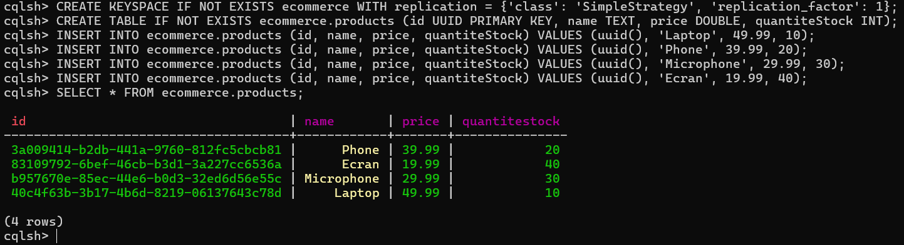
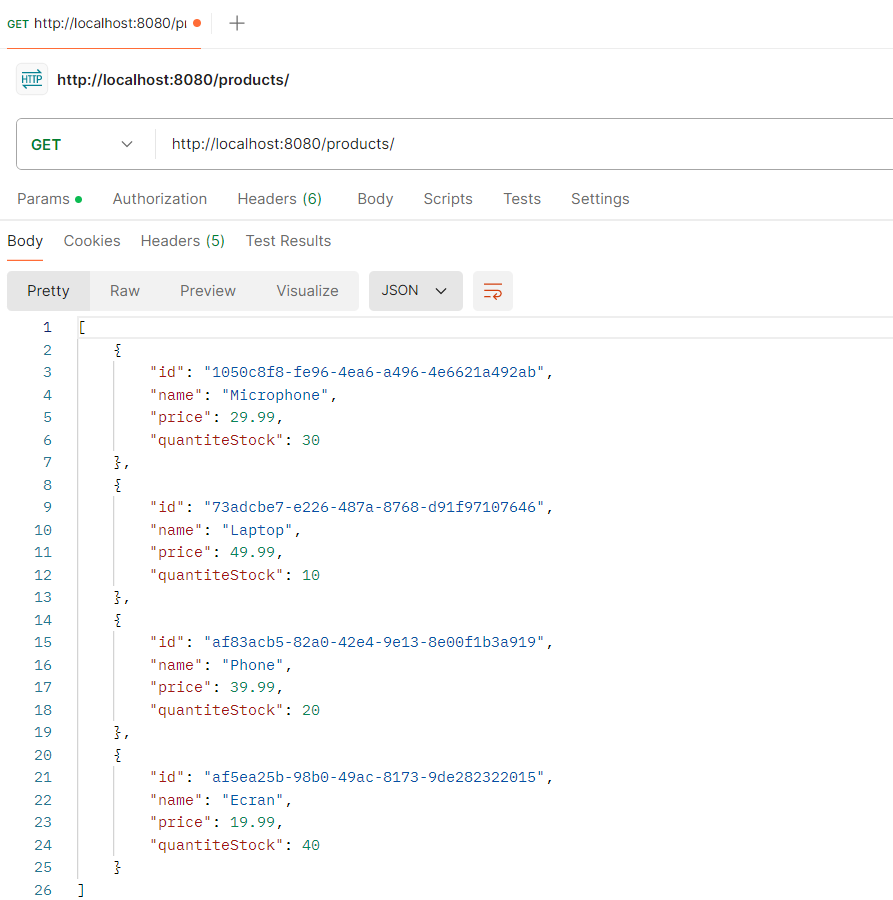
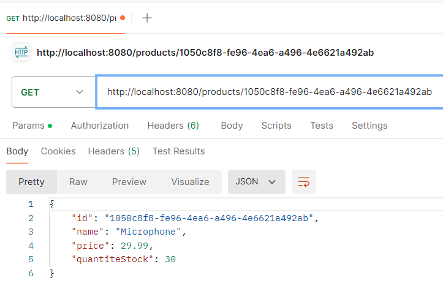
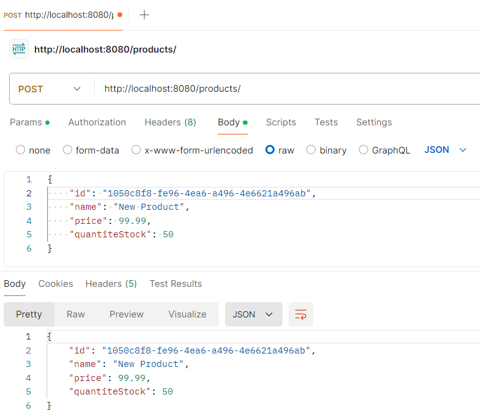
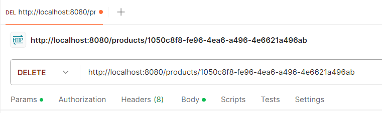
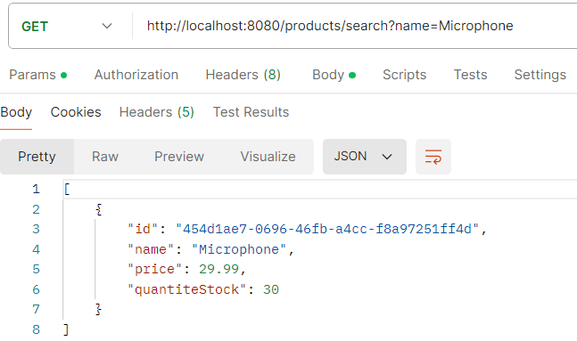

# Manipulation d'une base de donnée cassandra avec Spring Boot Application

## Objectif

L'objectif de ce travail est de manipuler une base de données Cassanda à partir d'une application Spring Boot, pour gérer un keystore nommé ecommerce qui va contenir une table products.

## Structure du projet

```
   src
    ├───main
    │   ├───java
    │   │   └───com
    │   │       └───errami
    │   │           └───cassandra_springboot
    │   │               ├───entities
    │   │                     Product
    │   │               ├───repositories
    │   │                     ProductRepository
    │   │               ├───services
    │   │                     ProductService
    │   │               └───web
    │   │                     ProductController
    │   │
    │   └───resources
    └───test
        └───java
```

## Travail à faire

1. Créer un keyspace ecommerce dans Cassandra
2. Créer une table products avec les colonnes suivantes:
   - id: UUID
   - name: Text
   - price: Double
   - quantity: Int

3. Créer une application Spring Boot.
4. Créer une entité Product pour réaliser les opérations d'accès à la  base données.
5. Créer un repository ProductRepository
6. Créer un service ProductService qui réalise les opérations CRUD de base et donne la possibilité de chercher des produits par mot clé.
7. Créer un controller ProductController qui expose les diffirentes fonctionlités de l'application.
8. Tester les opérations avec un outil comme Postman.

## La tâche 1 & 2



## La tâche 4
Code source :
```java
@Table("products")
@Data
@NoArgsConstructor
@AllArgsConstructor
@Builder
public class Product implements Serializable {
    @PrimaryKey
    private UUID id;
    private String name;
    private double price;
    private int quantiteStock;
}
```

## La tâche 5
Code source :
```java
public interface ProductRepository extends CassandraRepository<Product, UUID> {
    @Query("SELECT * FROM products WHERE name LIKE %:keyword%")
    List<Product> findByNameContaining(@Param("keyword") String keyword);
}
```

## La tâche 6
Code source :
```java
@Service
@AllArgsConstructor
public class ProductService {
    private ProductRepository productRepository;

    public Product save(Product product) {
        return productRepository.save(product);
    }

    public List<Product> getAllProducts(){
        return productRepository.findAll();
    }

    public Product getProductById(UUID uuid){
        return productRepository.findById(uuid).get();
    }

    public void deleteById(UUID id) {
        productRepository.deleteById(id);
    }

    public List<Product> findByNameContaining(String keyword) {
        return productRepository.findByNameContaining(keyword);
    }
}
```

## La tâche 7
Code source :
```java
@RestController
@AllArgsConstructor
@RequestMapping("/products")
public class ProductRestController {
    private ProductService productService;

    @PostMapping
    public Product createProduct(@RequestBody Product product) {
        return productService.save(product);
    }

    @GetMapping
    public List<Product> getAllProducts(){
        return productService.getAllProducts();
    }

    @GetMapping("/{id}")
    public Product getProductById(@PathVariable UUID id){
        return productService.getProductById(id);
    }

    @DeleteMapping("/{id}")
    public void deleteProductById(@PathVariable UUID id) {
        productService.deleteById(id);
    }

    @GetMapping("/search")
    public List<Product> searchProducts(@RequestParam String keyword) {
        return productService.findByNameContaining(keyword);
    }
}
```

## La tâche 8

- **Récuperer tous les produits :**



- **Récuperer un produit par son id :**



- **Créer un produit :**



- **Supprimer un produit par son id :**



- **Rechercher un produit par mot clé (nom) :**

